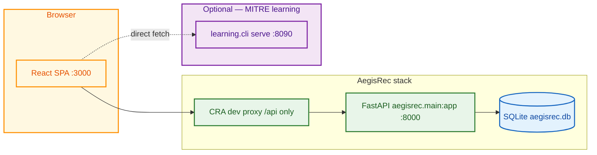
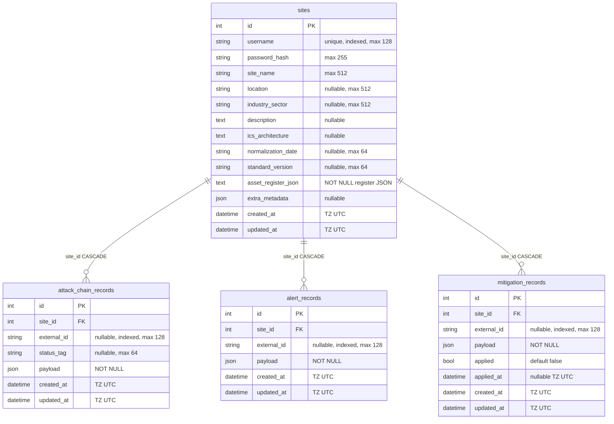
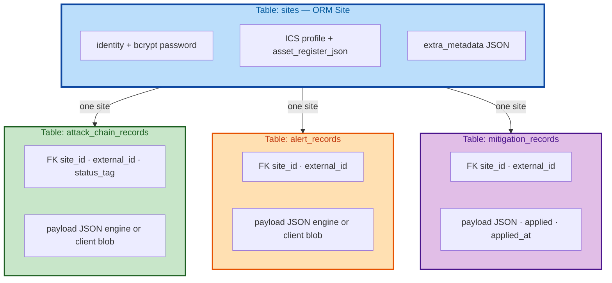
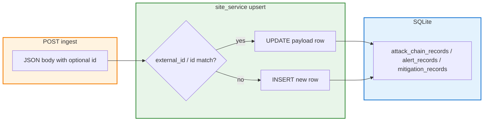

# AegisRec

AegisRec is a web application for **ICS/OT security operations** aligned with **MITRE ATT&CK for ICS**. It combines a **site-scoped API and SQLite persistence** (asset register, attack chains, alerts, mitigations) with a **React dashboard** that can attach to a separate **MITRE-style detection / learning service** for live snapshots, polling, and feedback.

This README reflects the **current implementation** in this repository (not a roadmap-only description).

---

## 1. Project Overview

### What AegisRec is

- **Site portal**: Each deployment is oriented around a single **ICS/OT site** record (metadata + a JSON **asset register**).
- **Operational UI**: Dashboards and workflows for **TTPs**, **attack chains**, **alerts**, **mitigations**, **monitoring**, and an **AI assistant** page (assistant replies today are **template-based** over database context; no external LLM is required).
- **Dual-backend mental model**:
  - **AegisRec API** (FastAPI, default port **8000**): authentication, asset register, persistence of detection artifacts, and assistant chat endpoint.
  - **Detection engine** (optional, separate process, typically **8090**): MITRE `learning` service providing `/health`, `/snapshot`, scoring, feedback, etc. The UI treats these as **different URLs** on purpose.

### Purpose and key capabilities

- Persist and display **attack chains**, **alerts**, and **mitigations** per site (with **upsert** semantics when payloads include an `id`).
- Surface **asset register** content (upload/normalize flows in the UI; canonical JSON stored server-side).
- Merge **live engine snapshots** with **persisted API snapshots** when the engine is down or unreachable.
- **JWT authentication** scoped to the logged-in site.

---

## 2. Features

| Area | Description |
|------|-------------|
| **Authentication** | Login with username/password; JWT stored in `localStorage`; `/api/auth/me` restores session. |
| **Asset register** | View and manage register data; backend stores one JSON document per site; seeded sample for development. |
| **Asset inventory** | Inventory-oriented view over register-related data. |
| **Attack chains** | List/detail/timeline components; persistence via `POST /api/site/attack-chains` and merge with engine data. |
| **Alerts** | Tables, detail drawers, severity/triage visuals; ingest via API and/or engine snapshot. |
| **Mitigations** | Cards and detail UI; **PATCH** applied state to the API (`persistedRecordId`). |
| **TTPs & monitoring** | Tactic-oriented views and monitoring/log-oriented UI wired to engine snapshot and demo fixtures. |
| **AI assistant** | Chat UI calling `/api/assistant/chat`; responses summarize site + counts from DB (extensible to real LLM). |
| **Settings** | Engine base URL, polling, timeouts, demo mode, layer thresholds (client-side config, `localStorage`). |
| **Documentation** | In-app documentation page. |
| **Demo mode** | Loads local `detectionSample` fixtures instead of the live engine. |
| **Offline / persisted state** | When the engine is unavailable, UI can still show **persisted** chains/alerts/mitigations from the AegisRec API. |

---

## 3. Architecture

### High-level system design



- **Development**: `npm start` serves the SPA on **3000**. Only paths under **`/api`** are proxied to the FastAPI host (see `app/client/src/setupProxy.js` and `AEGISREC_PROXY_TARGET` in `start-dev.sh`).
- **Detection engine**: The SPA calls the engine URL **directly** (not via `/api`). Default engine URL is `http://127.0.0.1:8090` (see `app/client/src/utils/engineBaseUrl.js`). Port **8000** is intentionally **not** used as the engine port in local dev, because it is reserved for the AegisRec API.

### Interaction summary

1. User logs in → **AegisRec API** returns JWT + public site profile → client stores token and loads **asset register**.
2. **EngineContext** polls **engine** `/health` and `/snapshot` (unless demo mode). On success, data is normalized to a common snapshot shape.
3. In parallel, the client may fetch **`/api/site/persisted-snapshot`** and **merge** with the live snapshot so rows survive engine restarts.
4. Mitigation “applied” toggles can call **`PATCH /api/site/mitigations/{record_id}`** so persistence stays authoritative.

---

## 4. Frontend

### Technologies

- **React** 19, **react-router-dom** 7, **Create React App** (`react-scripts` 5)
- **Tailwind CSS** 3
- **reactflow** + **dagre** (graph/diagram views)
- **lucide-react** / **@heroicons/react**
- **xlsx** (spreadsheet-related flows)

### Application structure (selected)

| Path | Role |
|------|------|
| `app/client/src/App.js` | Routes and provider nesting (`SettingsProvider` → `AuthProvider` → `EngineProvider`). |
| `app/client/src/context/SettingsContext.jsx` | User settings + `localStorage` persistence (engine URL, intervals, demo mode, layer knobs). |
| `app/client/src/context/AuthContext.jsx` | Token, site profile, asset register, login/logout, bootstrap `/api/auth/me`. |
| `app/client/src/context/EngineContext.jsx` | Engine connectivity state machine, snapshot merge, persisted fallback, demo loader. |
| `app/client/src/api/siteApi.js` | All **AegisRec API** calls (`/api/...`) with `Authorization: Bearer`. |
| `app/client/src/api/detectionApi.js` | **Engine** endpoints: `/health`, `/snapshot`, scoring, feedback, poll tick. |
| `app/client/src/api/client.js` | Shared `request` helper + `EngineError` typing. |
| `app/client/src/components/sidebar.jsx` | Primary navigation. |
| `app/client/src/components/ProtectedRoute.jsx` | Guards authenticated routes. |
| `app/client/src/components/detection/*` | Cards, tables, drawers, timeline, log stream. |
| `app/client/src/components/ai/*` | Assistant chat UI. |
| `app/client/src/pages/*` | Top-level screens (Dashboard, Asset Register, Alerts, …). |
| `app/client/src/setupProxy.js` | Proxies **`/api`** to the FastAPI process. |

### Data flow and state management

- **No Redux**: state is **React Context** + local/component state.
- **Auth**: JWT in `localStorage` (`siteApi` helpers); `AuthContext` refreshes asset register after login.
- **Engine**: `EngineContext` holds `status` (`idle` | `loading` | `connected` | `offline` | `degraded` | `demo` | `persisted`), `health`, merged `data` snapshot, and `refresh`.
- **Settings**: `SettingsContext` deep-merges defaults with `localStorage` key `aegisrec:settings:v1`.

---

## 5. Backend

### Directory layout (`app/server`)

```text
app/server/
├── aegisrec/
│   ├── main.py              # FastAPI app factory, CORS, routers, startup (DB + seed)
│   ├── config/              # Environment-backed settings
│   ├── core/                # SQLAlchemy engine/session, password + JWT
│   ├── models/              # ORM entities
│   ├── schemas/             # Pydantic request/response models
│   ├── services/            # Business logic (persistence, assistant reply text)
│   ├── controllers/         # Thin HTTP handlers delegating to services
│   ├── api/
│   │   ├── deps.py          # get_current_site (Bearer JWT)
│   │   └── routes/          # auth, site, assistant, system
│   ├── middleware/          # CORS setup
│   ├── utils/               # Snapshot serialization for the React client
│   └── seed/                # Optional bootstrap data (JSON-driven)
├── seed/
│   └── grfics_asset_register.json
├── requirements.txt
├── .venv/                   # local virtualenv (created by start-dev.sh)
└── aegisrec.db              # SQLite file (default location)
```

### API design

Routers are mounted under **`/api`** except **system** routes (root `/` and `/health`).

| Method | Path | Auth | Role |
|--------|------|------|------|
| `GET` | `/` | No | Service banner |
| `GET` | `/health` | No | Liveness; identifies `aegisrec-api` vs engine |
| `POST` | `/api/auth/login` | No | Issue JWT + `SitePublic` |
| `GET` | `/api/auth/me` | Bearer | Current site profile |
| `GET` | `/api/site/asset-register` | Bearer | Parsed JSON register for site |
| `GET` | `/api/site/persisted-snapshot` | Bearer | Chains, alerts, mitigations from DB |
| `PATCH` | `/api/site/mitigations/{record_id}` | Bearer | Set `applied` flag |
| `POST` | `/api/site/attack-chains` | Bearer | Upsert chain (by payload `id` → `external_id`) |
| `POST` | `/api/site/alerts` | Bearer | Upsert alert |
| `POST` | `/api/site/mitigations` | Bearer | Upsert mitigation |
| `POST` | `/api/assistant/chat` | Bearer | Template reply + `context_summary` |

**Layers**

- **Routes** (`api/routes/*`): parameter parsing, `Depends(get_db)`, `Depends(get_current_site)`.
- **Controllers** (`controllers/*`): map HTTP exceptions, delegate to services.
- **Services** (`services/*`): ORM work and response shaping (e.g. `site_service`, `assistant_service`).

### Authentication mechanism

1. **Login**: `auth_service` verifies **bcrypt** password hash on `sites.username`, then issues a **JWT** (`python-jose`, HS256) with `sub` = stringified **site id** and expiry from settings.
2. **Protected routes**: `HTTPBearer` → `decode_access_token` → load `Site` by id; 401 on missing/invalid/expired tokens.
3. **Secrets**: `AEGISREC_JWT_SECRET` (see below); default dev value is insecure and must be changed for any shared deployment.

---

## 6. Database

### Engine

- Default: **SQLite** file at `app/server/aegisrec.db`.
- Override with **`AEGISREC_DATABASE_URL`** (any SQLAlchemy URL).

### Complete schema (entity–relationship)

The diagram below matches **`aegisrec.models.site`** (SQLAlchemy 2.0): table names, columns, PK/FK, and **`ON DELETE CASCADE`** from child tables to `sites.id`. Types are logical (SQLite + SQLAlchemy); `datetime` columns are **timezone-aware** in the ORM.



### Cardinality and ownership (color overview)



### Payload storage and upsert semantics

Engine/UI objects are stored as **`payload` JSON** on child rows. **`external_id`** mirrors `payload.id` when present so **`site_service`** can upsert by external id. Mitigations additionally persist analyst state in **`applied`** / **`applied_at`** (API: `PATCH /api/site/mitigations/{record_id}`).



### Main entities (summary)

**`sites` (Site)** — one row per logical ICS/OT site in this codebase: credentials, profile fields, **`asset_register_json`** (canonical register), optional **`extra_metadata`**, timestamps.

**`attack_chain_records`**, **`alert_records`**, **`mitigation_records`** — child rows with **`site_id`** → **`sites.id`** (`ON DELETE CASCADE`), optional **`external_id`** (indexed), JSON **`payload`**, and UTC **`created_at` / `updated_at`**. Chains add **`status_tag`**; mitigations add **`applied`** and **`applied_at`**.

### Relationships (text)

```text
Site (1) ──< (N) AttackChainRecord
Site (1) ──< (N) AlertRecord
Site (1) ──< (N) MitigationRecord
```

### Client-facing snapshot shape

`site_service.build_persisted_snapshot` returns objects where each row’s JSON **`payload`** is merged with:

- Stable **`id`** (prefers payload `id`, else `external_id`)
- **`persistedRecordId`** (database primary key) for PATCH operations

Mitigations add a derived **`status`**: `implemented` if `applied`, else payload `status` or `proposed`.

---

## 7. Installation & Setup

### Prerequisites

- **Node.js** + **npm** (for the React app)
- **Python 3** (3.10+ recommended; project tested with 3.13 in dev)
- **Git**

### Quick start (API + UI together)

From the repository root:

```bash
chmod +x start-dev.sh   # first time, if needed
./start-dev.sh
```

This script:

1. Creates `app/server/.venv` if missing and installs `app/server/requirements.txt`
2. Runs **`uvicorn aegisrec.main:app`** from `app/server` on `AEGISREC_API_HOST` / `AEGISREC_API_PORT` (defaults **127.0.0.1:8000**)
3. Waits for the port to accept connections
4. Runs **`npm start`** in `app/client` (port **3000**)

- **API**: `http://127.0.0.1:8000` (OpenAPI: `/docs`)
- **UI**: `http://localhost:3000`

### Optional: MITRE detection / learning service

The UI expects a **separate** engine process for live detection data (not bundled in this repo). Example from `start-dev.sh` comments:

```bash
cd MITRE-ATTACK-for-ICS-Detection-and-Correlation-Engine
python -m learning.cli serve
```

Default API port in MITRE `config/learning.yml` is typically **8090**, matching the client default in `engineBaseUrl.js`.

### Manual run (split terminals)

**Backend**

```bash
cd app/server
python3 -m venv .venv
source .venv/bin/activate
pip install -r requirements.txt
uvicorn aegisrec.main:app --reload --host 127.0.0.1 --port 8000
```

**Frontend**

```bash
cd app/client
npm install
# For local dev with proxy, point proxy at API (start-dev.sh sets this automatically):
export AEGISREC_PROXY_TARGET=http://127.0.0.1:8000
npm start
```

### Environment variables

**Backend (`aegisrec`)**

| Variable | Purpose | Default |
|----------|---------|---------|
| `AEGISREC_DATABASE_URL` | SQLAlchemy URL | `sqlite:///.../app/server/aegisrec.db` |
| `AEGISREC_JWT_SECRET` | JWT signing key | `dev-insecure-change-me` (override in prod) |
| `AEGISREC_JWT_EXPIRE_MINUTES` | Token lifetime | `10080` (7 days) |

**Frontend / dev proxy**

| Variable | Purpose |
|----------|---------|
| `AEGISREC_PROXY_TARGET` | Where CRA should proxy `/api` (set by `start-dev.sh`) |
| `REACT_APP_API_URL` | Absolute API base; **unset** in default dev so same-origin `/api` + proxy is used |
| `BROWSER` | e.g. `none` to stop CRA opening a browser automatically |

---

## 8. Usage

### First login (seeded development user)

On first startup, if no `grficsadmin` user exists, the server seeds from `app/server/seed/grfics_asset_register.json`.

- **Username**: `grficsadmin`  
- **Password**: `admin`

Change this user or disable seeding before any production use.

### Typical workflows

1. **Sign in** → land on **Dashboard** with engine/persisted status from `EngineContext`.
2. **Settings** → set **Engine URL** (e.g. `http://127.0.0.1:8090`), polling interval, and optional **demo mode**.
3. **Asset Register** → review/upload/normalize assets; data is persisted in **`sites.asset_register_json`**.
4. **Alerts / Mitigations / TTPs / Monitoring** → explore merged engine + persisted data; open drawers for details.
5. **Mark mitigation applied** → UI issues **`PATCH /api/site/mitigations/{persistedRecordId}`** so the `applied` bit survives refreshes.
6. **AI Assistant** → ask questions; responses summarize DB-backed context (counts, architecture blurb). Replace `assistant_service` with an LLM-backed implementation when ready.

### Health checks

- **AegisRec API**: `GET http://127.0.0.1:8000/health` → JSON with `"service": "aegisrec-api"`.
- **Engine**: `GET {engine}/health` must **not** return the AegisRec service string — the client explicitly rejects pointing the engine URL at the site API.

---

## 9. Future Improvements

Ideas that fit the current architecture without rewriting the stack:

- **Assistant**: Swap template replies in `assistant_service` for an LLM with retrieval over site JSON + ORM rows; keep `AssistantChatResponse.context_summary` for UI tooling.
- **Multi-site / RBAC**: Today one username maps to one `Site` row; introduce organizations, roles, or admin APIs as needed.
- **Stricter API contracts**: Replace `dict` bodies on ingest routes with versioned Pydantic models matching the engine schema.
- **Migrations**: Add Alembic for SQLite → Postgres/MySQL in larger deployments.
- **Testing**: Pytest for services + HTTP integration; React Testing Library for critical flows.
- **Observability**: Structured logging, request IDs, metrics on ingest paths.
- **Real-time**: WebSockets or SSE from engine → UI for log streaming instead of polling-only.

---

## License / attribution

MITRE-related tooling and detection logic live in separate repositories; this project **integrates** with them via HTTP and does not vendor the full engine here.

For questions or contributions, use the repository’s issue tracker and follow existing code style in `app/client` and `app/server/aegisrec`.
